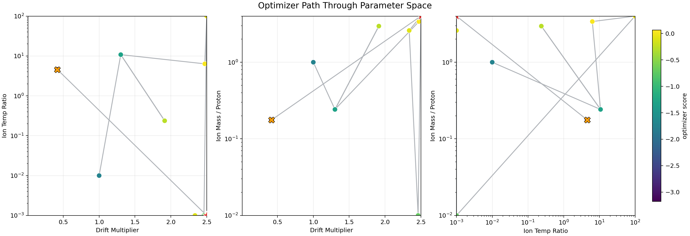
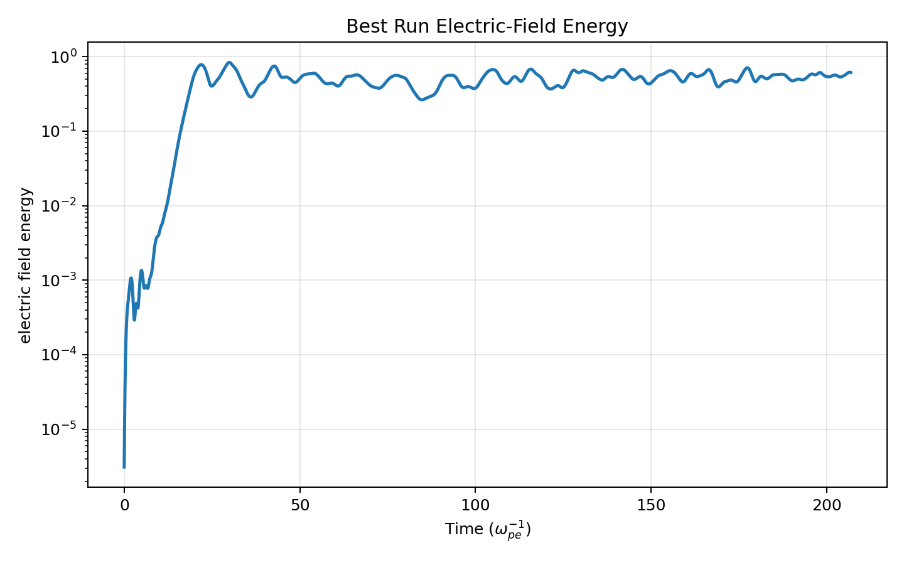
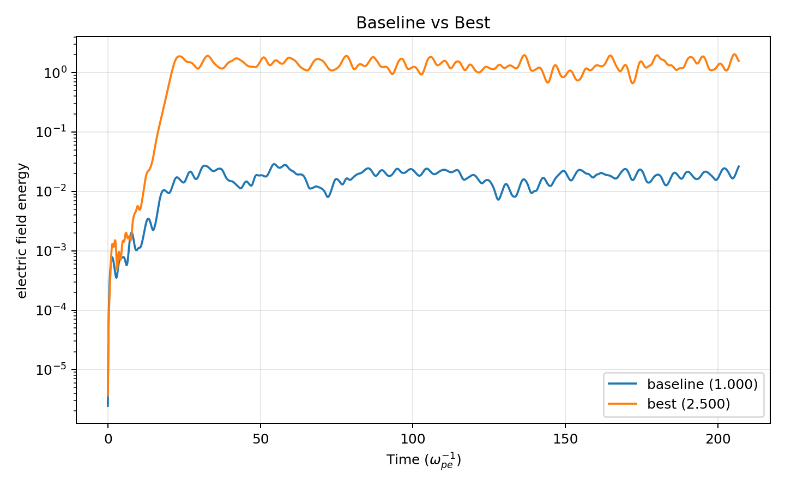
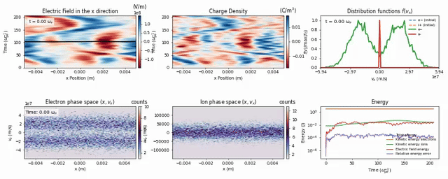
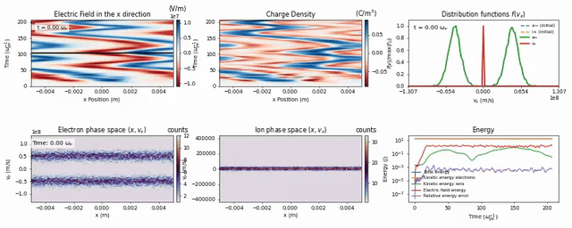
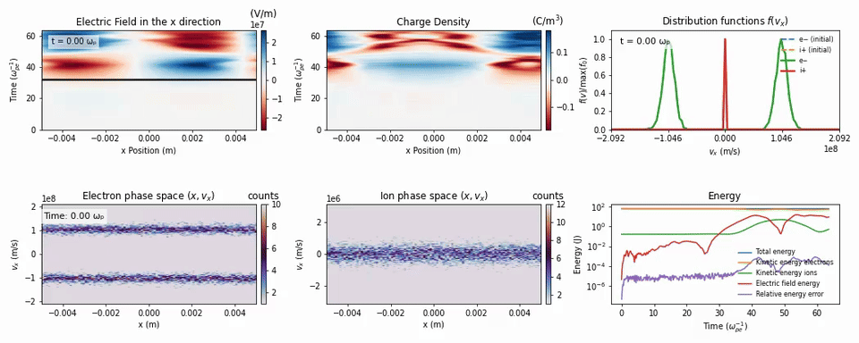

# PIC Agentic Workflow

PIC Agentic Workflow is a live optimization lab around [uwplasma/JAX-in-Cell](https://github.com/uwplasma/JAX-in-Cell). It continuously explores a plasma parameter space and publishes the latest leaderboard, reasoning, and artifacts back into this repository.

The goal is simple: find parameter settings that maximize late-time electrostatic energy in the two-stream instability, while keeping every trial visible, reproducible, and easy to inspect from the repository page itself.

<!-- leaderboard:start -->

## Optimization Leaderboard

This table updates directly on the live `main` branch. Higher score means stronger nonlinear electrostatic saturation.

Search ranges: drift=[0.01, 2.5], ion temperature ratio=[0.001, 100.0], ion mass over proton mass=[0.01, 4.0]

| Rank | Trial | Started | Drift x Base | Ion Temp Ratio | Ion Mass / Proton | Tail Mean E | Score |
| --- | --- | --- | ---: | ---: | ---: | ---: | ---: |
| 1 | trial_0008 | 2026-04-09 23:06 UTC | 2.500000 | 1.000000e-03 | 4.000000e+00 | 1.158855e+00 | 0.064029 |
| 2 | trial_0004 | 2026-04-09 17:37 UTC | 2.473555 | 6.356750e+00 | 3.397872e+00 | 1.088230e+00 | 0.036721 |
| 3 | trial_0005 | 2026-04-09 19:44 UTC | 2.500000 | 1.000000e+02 | 4.000000e+00 | 9.433231e-01 | -0.025340 |
| 4 | trial_0007 | 2026-04-09 22:03 UTC | 2.337084 | 1.000000e-03 | 2.595988e+00 | 7.957262e-01 | -0.099236 |

<details>
<summary>Show ranks 5-20</summary>

| Rank | Trial | Started | Drift x Base | Ion Temp Ratio | Ion Mass / Proton | Tail Mean E | Score |
| --- | --- | --- | ---: | ---: | ---: | ---: | ---: |
| 5 | trial_0002 | 2026-04-09 14:52 UTC | 1.913983 | 2.371407e-01 | 2.962437e+00 | 5.394634e-01 | -0.268038 |
| 6 | trial_0006 | 2026-04-09 21:08 UTC | 2.461772 | 1.000000e-03 | 1.000000e-02 | 1.951065e-01 | -0.709728 |
| 7 | trial_0003 | 2026-04-09 16:01 UTC | 1.301660 | 1.079942e+01 | 2.420796e-01 | 4.837480e-02 | -1.315381 |
| 8 | trial_0001 | 2026-04-09 14:50 UTC | 1.301660 | 1.079942e+01 | 2.420796e-01 | 4.571948e-02 | -1.339899 |
| 9 | trial_0000 | 2026-04-09 14:48 UTC | 1.000000 | 1.000000e-02 | 1.000000e+00 | 1.867578e-02 | -1.728721 |
| 10 | trial_0009 | 2026-04-09 23:58 UTC | 0.417255 | 4.578978e+00 | 1.764390e-01 | 6.635360e-04 | -3.178136 |

</details>

### Parameter Space Map

This live figure shows where the optimizer has already looked, the order it moved through the search space, the current best point, and the next suggested point.



### Follow The Search

- Read the agent's public reasoning: [reports/agent_reasoning.md](reports/agent_reasoning.md)
- Watch scheduled live runs: [Optimize Scheduled](https://github.com/uwplasma/PIC_AGENTIC_WORKFLOW/actions/workflows/optimize-scheduled.yml)
- Watch manual runs: [Optimize Dispatch](https://github.com/uwplasma/PIC_AGENTIC_WORKFLOW/actions/workflows/optimize-dispatch.yml)
- Watch optimization commits land on main: [main commit history](https://github.com/uwplasma/PIC_AGENTIC_WORKFLOW/commits/main/)
- See how the next point is chosen: [reports/agent_reasoning.md](reports/agent_reasoning.md), [src/jaxincell_drift_opt/optimizer_loop.py](src/jaxincell_drift_opt/optimizer_loop.py), and [configs/search.yaml](configs/search.yaml)

### Exact Scored Energy Traces

These PNGs come from the exact saved trial timeseries used for scoring. Use them for quantitative electric-field-energy comparisons; the time axis is shown in $\omega_{pe}^{-1}$.

#### Best scored run



#### Baseline vs best



### Movies

These GIFs are rendered from the full saved trial configurations with no solver caps. They use frame skipping only, so they stay short while still covering the full simulation window.

#### Initial baseline



#### Leaderboard rank 1



#### Leaderboard rank 2



<!-- leaderboard:end -->

## What You’re Looking At

- The leaderboard above is the live public state of the current optimization campaign.
- The static plots use inverse plasma-frequency units, so the time axis is shown in $\omega_{pe}^{-1}$ instead of seconds.
- The GIFs are rendered from the full saved simulations for the initial baseline and the current top two leaderboard entries.
- The live solver baseline lives in [configs/base_input.toml](configs/base_input.toml), and the smaller CI smoke case lives in [configs/base_input_smoke.toml](configs/base_input_smoke.toml).

## How Scoring Works

The optimization target is the tail mean of the electric-field energy over the final 20% of each run:

`tail_mean_E = mean(electric_field_energy over final 20% of steps)`

The public leaderboard score is:

`optimizer_score = log10(tail_mean_E + eps)`

Higher is better.

## Run Locally

If you have a local sibling checkout of JAX-in-Cell:

```bash
python -m pip install --upgrade pip
python -m pip install -e /Users/rogerio/local/JAX-in-Cell
python -m pip install -r requirements.txt
python -m pip install -e .
```

If you want to install against the pinned GitHub dependency path instead:

```bash
python -m pip install --upgrade pip
python -m pip install -r requirements.txt
python -m pip install -e .
```

Run one trial:

```bash
python scripts/run_one_trial.py --drift-multiplier 1.0 --ion-temperature-ratio 0.01 --ion-mass-over-proton-mass 1.0
```

Run a small campaign:

```bash
python scripts/run_campaign.py --num-trials 3
```

## Where Things Live

- [configs](configs): live and smoke input decks, search ranges, scoring, and movie render settings
- [state](state): current optimizer state, trials table, and best-result snapshot
- [results](results): per-trial artifacts, frozen inputs, plots, and time series
- [reports](reports): live summaries, reasoning logs, plots, and README assets
- [.github/workflows](.github/workflows): CI plus scheduled and manual optimization workflows

## Follow The Automation

- [Optimize Scheduled](https://github.com/uwplasma/PIC_AGENTIC_WORKFLOW/actions/workflows/optimize-scheduled.yml)
- [Optimize Dispatch](https://github.com/uwplasma/PIC_AGENTIC_WORKFLOW/actions/workflows/optimize-dispatch.yml)
- [main commit history](https://github.com/uwplasma/PIC_AGENTIC_WORKFLOW/commits/main/)
- [reports/agent_reasoning.md](reports/agent_reasoning.md)

If you want to inspect the optimizer internals in more detail, start with [reports/agent_reasoning.md](reports/agent_reasoning.md), [src/jaxincell_drift_opt](src/jaxincell_drift_opt), and [.github/workflows](.github/workflows).
